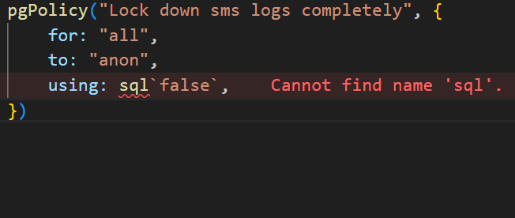

    npm run db:generate

    > backend@1.0.0 db:generate
    > drizzle-kit generate

    No config path provided, using default 'drizzle.config.ts'
    Reading config file 'C:\Users\USER\Desktop\CODEINE\hackathonTingz\ZiwaClear\Ziwaclear\backend\drizzle.config.ts'
    ◇ injected env (0) from .env // tip: ◈ secrets for agents [www.dotenvx.com]
    ◇ injected env (0) from .env // tip: ⌘ override existing { override: true }
    0 tables

    No schema changes, nothing to migrate 😴

1.Error was returned once I tried to generate my tables.

-The error was that Drizzle Kit was pointed to the db connection instead of the index file that should have the table structures.

**FIX:** 

-Point the schema path to the file that actually exports all the tables, which is the schema bundle file inside the schema folder.

2.

**Cause:** The keyword 'sql' is a tagged template literal that tells Drizzle to compile whatever is inside the backticks directly into raw SQL.

-In TS, a library variable cannot be used without importing it first.

-Add the following line to imports:

    import { sql } from "drizzle-orm";

    //for every file where the policy has been defined, add the line above.